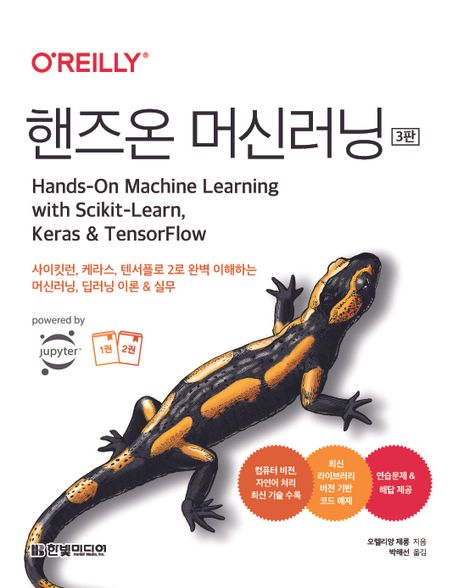

### KDT(Korea Digital Training)- NUMPY

교재 : 핸즈온 머신러닝

- 오렐리앙 제롱, 박해선(한빛 미디어)  
  [교재 사이트](https://product.kyobobook.co.kr/detail/S000208981368)  
  [교재 정오표](https://tensorflow.blog/handson-ml3/)  
  [필독!!! 교재 소스 코드](https://github.com/rickiepark/handson-ml3)  
  [UCI_MACHINE(데이터 사이트)](https://archive.ics.uci.edu/)
  

  

    그 외의 관련 사이트
  

  [머신 러닝이 적용되는 사례](https://en.wikipedia.org/wiki/Machine_learning#Applications)  
   [learnpython.org](https://learnpython.org/)  
  [pandas.org](https://pandas.pydata.org/docs/)  
  [numpy.org](https://numpy.org/doc/stable/)  
  [matplotlib.org](https://matplotlib.org/stable/users/index)  
  [머신러닝강좌(앤드루 응)](https://www.coursera.org/learn/machine-learning/)  
  [사이킷런 사용자 가이드](https://scikit-learn.org/stable/user_guide.html)  
  [Quora-머신러닝 블로그](https://quora.com/What-are-the-best-artificial-intelligence-blogs-newsletters)

#### 개발환경

| 패키지 이름  | 버전    | 사용 커맨드(Version command) |
| ------------ | ------- | ---------------------------- |
| Python       | 3.9.18  | python --version             |
| jupyter      | 1.0.0   | pip show jupyter             |
| ipython      | 8.12.2  | pip show ipython             |
| notebook     | 7.0.6   | pip show notebook            |
| numpy        | 1.24.3  | pip show numpy               |
| pandas       | 2.1.4   | pip show pandas              |
| matplotlib   | 3.8.0   | pip show matplotlib          |
| statsmodels  | 0.14.0  | pip show statsmodels         |
| Scikit-learn | 1.3.0   | pip show scikit-learn        |
| Seaborn      | 0.12.2  | pip show seaborn             |
| bs4          | 4.12.2  | pip show bs4                 |
| selenium     | 3.141.0 | pip show selenium            |

   
   
|날짜(Date) | 제목 | 네이버 블로그 | 관련 디렉토리 |
| --------  | ---  | -----------| ------------|
| 23.02.23  |  머신러닝 가상환경 설정, 클래스 복습 | [Naver Blog](https://blog.naver.com/mathnoah/223362791122)         | DAY01/check_pk, ex_class, ex_class_02  |
| 23.02.25  |  KNeighborClassifier, K-NN, kneighbors | [Naver Blog](https://blog.naver.com/mathnoah/223364565653)         | DAY01/ex_find_fish.ipynb|
| 23.02.25  | 지도학습 분류 모델(1) : K-NN, K-neighbor  | [Naver Blog](https://blog.naver.com/mathnoah/223364567676)         | DAY01/review.ipynb  |
| 23.02.25  | K-NN : iris 데이터 분류 적용  | [Naver Blog](https://blog.naver.com/mathnoah/223364568845)         | DAY01/HW_01_명노아.ipynb  |
| 23.02.26  |KNN(복습) | [Naver Blog](https://blog.naver.com/mathnoah/223365314255)  | DAY02/01_find_fish_knn.ipynb  |
| 23.02.26  |샘플링(판다스, 사이킷런) : pandas.DataFrame.sample, sklearn.model_selection.train_test_split | [Naver Blog](https://blog.naver.com/mathnoah/223365376406)  | DAY02/01_find_fish_knn.ipynb  |
| 23.02.26  | 데이터 정규화의 필요성(sklearn, 모형의 오분류)| [Naver Blog](https://blog.naver.com/mathnoah/223365548990)  | DAY02/03_find_fish_normalization.ipynb  |
| 23.02.26  | 데이터 전처리 : StandardScalar, transform , sklearn.svm.SVC| [Naver Blog](https://blog.naver.com/mathnoah/223365678380)  | DAY02/04_fish_sklearn.ipynb  |
| 23.02.26  |튜닝(Tunning) | [Naver Blog](https://blog.naver.com/mathnoah/223365773861)  | DAY02/05_fish_Tunning.ipynb  |
| 23.02.27  | 회귀 분석(sklearn.metrics) : mean_squared_error, mean_absolute_error, r2_score | [Naver Blog](https://blog.naver.com/mathnoah/223366718832)  | DAY03  |
| 23.03.03  | sklearn 머신러닝 분석 총정리(기본)| [Naver Blog](https://blog.naver.com/mathnoah/223371692522)  | DAY04  |
| 23.03.04  |  Scikit-learn 라이브러리, Sklearn, 거리측정법, 다운샘플링, 업샘플링, 정규화 종류| [Naver Blog](https://blog.naver.com/mathnoah/223372584445)  | DAY05  |
| 23.03.04  | 데이터 변환 : 이산화, 범주화, 인코딩 / 특성공학, 회귀모델 성능평가지표, 업데이트 최적화 기법 | [Naver Blog](https://blog.naver.com/mathnoah/223372644891)  | DAY06  |
| 23.03.04  | Logistic Regression(로지스틱 회귀), 시그모이드(sigmmid), 소프트맥스(softmax) | [Naver Blog](https://blog.naver.com/mathnoah/223372670356)  | DAY06  |
| 23.03.05  | 경사하강법(Gradient Descent), SGDClassifier, partial_fit | [Naver Blog](https://blog.naver.com/mathnoah/223373496572)  | DAY06/class/ex_classification_performance.ipynb  |
| 23.03.05  |  MNIST_database, 지도학습을 통한 분류 실습 | [Naver Blog](https://blog.naver.com/mathnoah/223373716117)  | DAY07/ex_mnish_classification.ipynb  |
| 23.03.05  | Ridge(L2), Lasso(L1) | [Naver Blog](https://blog.naver.com/mathnoah/223373795689)  | DAY07/ex_fish_ridge_lasso.ipynb  |
| 23.03.06  |  교차검증 : KFold(K-폴드), StratifiedKFold, cross_val_score, cross_val_predict, cross_validate| [Naver Blog](https://blog.naver.com/mathnoah/223374614841)  | DAY07/ex_kflod.ipynb  |
| 23.03.06  | 모델 성능평가 자동화 : GridSearchCV, all_estimators | [Naver Blog](https://blog.naver.com/mathnoah/223374622306)  | DAY07/01_명노아_all_estimators, 02_명노아_Lasso.ipynb  |
| 23.03.07  | DT(Decision Tree), Graphviz 설치, 의사결정나무 시각화, joblib, .pkl | [Naver Blog](https://blog.naver.com/mathnoah/223375883551)  | DAY08/ex_Decision tree.ipynb  |
| 23.03.07  | 앙상블 | [Naver Blog](https://blog.naver.com/mathnoah/223376177162)  | DAY09/ex_cancer*.ipynb  |
| 23.03.11  | XGBoost | [Naver Blog](https://blog.naver.com/mathnoah/223379906987)  | DAY09/ex_XGBoost(eXtra Gradient Boost).ipynb  |
| 23.03.11  | XGBoost( 사이킷런 래퍼, Scikit-learn Wrapper ) | [Naver Blog](https://blog.naver.com/mathnoah/223379910908)  | DAY09/ex_XGBoost(eXtra Gradient Boost).ipynb  |
| 23.03.11  | LightGBM : 활용,  XGBoost와의 차이점  | [Naver Blog](https://blog.naver.com/mathnoah/223379928111)  | DAY09/ex_LightGBM.ipynb  |
### 목차

  

    [1부, 머신러닝]
  

  
# [1부 머신러닝]
## 1장 한눈에 보는 머신러닝
### 1.1 머신러닝이란?
### 1.2 왜 머신러닝을 사용하나요?
### 1.3 애플리케이션 사례
### 1.4 머신러닝 시스템의 종류
- 1.4.1 훈련 지도 방식
  - 지도 학습
  - 비지도 학습
  - 준비도 학습
  - 자기 지도 학습
  - 강화 학습
- 1.4.2 배치 학습과 온라인 학습
  - 배치 학습
  - 온라인 학습
- 1.4.3 사례 기반 학습과 모델 기반 학습
  - 사례 기반 학습
  - 모델 기반 학습
### 1.5 머신러닝의 주요 도전 과제
- 1.5.1 충분하지 않은 양의 훈련 데이터
- 1.5.2 대표성 없는 훈련 데이터
- 1.5.3 낮은 품질의 데이터
- 1.5.4 관련없는 특성
- 1.5.5 훈련 데이터 과대적합
- 1.5.6 훈련 데이터 과소적합
- 1.5.7 핵심 요약
### 1.6 테스트와 검증
- 1.6.1 하이퍼파라미터 튜닝과 모델 선택
- 1.6.2 데이터 불일치
## 연습문제

## 2장 머신러닝 프로젝트 처음부터 끝까지

### 2.1 실제 데이터로 작업하기

### 2.2 큰 그림 보기

- 2.2.1 문제 정의
- 2.2.2 성능 측정 지표 선택
- 2.2.3 가정 검사

### 2.3 데이터 가져오기

- 2.3.1 구글 코랩을 사용하여 예제 코드 실행하기
- 2.3.2 코드와 데이터 저장하기
- 2.3.3 대화식 환경의 편리함과 위험
- 2.3.4 책의 코드와 노트북의 코드
- 2.3.5 데이터 다운로드
- 2.3.6 데이터 구조 훑어보기
- 2.3.7 테스트 세트 만들기

### 2.4 데이터 이해를 위한 탐색과 시각화

- 2.4.1 지리적 데이터 시각화하기
- 2.4.2 상관관계 조사하기
- 2.4.3 특성 조합으로 실험하기

### 2.5 머신러닝 알고리즘을 위한 데이터 준비

- 2.5.1 데이터 정제
- 2.5.2 텍스트와 범주형 특성 다루기
- 2.5.3 특성 스케일과 변환
- 2.5.4 사용자 정의 변환기
- 2.5.5 변환 파이프라인

### 2.6 모델 선택과 훈련

- 2.6.1 훈련 세트에서 훈련하고 평가하기
- 2.6.2 교차 검증으로 평가하기

### 2.7 모델 미세 튜닝

- 2.7.1 그리드 서치
- 2.7.2 랜덤 서치
- 2.7.3 앙상블 방법
- 2.7.4 최상의 모델과 오차 분석
- 2.7.5 테스트 세트로 시스템 평가하기

### 2.8 론칭, 모니터링, 시스템 유지 보수

### 2.9 직접 해보세요!

## 연습문제

## 3장 분류

### 3.1 MNIST

### 3.2 이진 분류기 훈련

### 3.3 성능 측정

- 3.3.1 교차 검증을 사용한 정확도 측정
- 3.3.2 오차 행렬
- 3.3.3 정밀도와 재현율
- 3.3.4 정밀도/재현율 트레이드오프
- 3.3.5 ROC 곡선

### 3.4 다중 분류

### 3.5 오류 분석

### 3.6 다중 레이블 분류

### 3.7 다중 출력 분류

## 연습문제

## 4장 모델 훈련

### 4.1 선형 회귀

- 4.1.1 정규 방정식
- 4.1.2 계산 복잡도

### 4.2 경사 하강법

- 4.2.1 배치 경사 하강법
- 4.2.2 확률적 경사 하강법
- 4.2.3 미니배치 경사 하강법

### 4.3 다항 회귀

### 4.4 학습 곡선

### 4.5 규제가 있는 선형 모델

- 4.5.1 릿지 회귀
- 4.5.2 라쏘 회귀
- 4.5.3 엘라스틱넷
- 4.5.4 조기 종료

### 4.6 로지스틱 회귀

- 4.6.1 확률 추정
- 4.6.2 훈련과 비용 함수
- 4.6.3 결정 경계
- 4.6.4 소프트맥스 회귀

## 연습문제

## 5장 서포트 벡터 머신

### 5.1 선형 SVM 분류

- 5.1.1 소프트 마진 분류

### 5.2 비선형 SVM 분류

- 5.2.1 다항식 커널
- 5.2.2 유사도 특성
- 5.2.3 가우스 RBF 커널
- 5.2.4 계산 복잡도

### 5.3 SVM 회귀

### 5.4 SVM 이론

- 5.5.1 커널 SVM

## 연습문제

## 6장 결정 트리

### 6.1 결정 트리 학습과 시각화

### 6.2 예측

### 6.3 클래스 확률 추정

### 6.4 CART 훈련 알고리즘

### 6.5 계산 복잡도

### 6.6 지니 불순도 또는 엔트로피?

### 6.7 규제 매개변수

### 6.8 회귀

### 6.9 축 방향에 대한 민감성

### 6.10 결정 트리의 분산 문제

## 연습문제

## 7장 앙상블 학습과 랜덤 포레스트

### 7.1 투표 기반 분류기

### 7.2 배깅과 페이스팅

- 7.2.1 사이킷런의 배깅과 페이스팅
- 7.2.2 OOB 평가

### 7.3 랜덤 패치와 랜덤 서브스페이스

### 7.4 랜덤 포레스트

- 7.4.1 엑스트라 트리
- 7.4.2 특성 중요도

### 7.5 부스팅

- 7.5.1 AdaBoost
- 7.5.2 그레이디언트 부스팅
- 7.5.3 히스토그램 기반 그레이디언트 부스팅
- 7.6 스태킹

## 연습문제

## 8장 차원 축소

### 8.1 차원의 저주

### 8.2 차원 축소를 위한 접근법

- 8.2.1 투영
- 8.2.2 매니폴드 학습

### 8.3 주성분 분석

- 8.3.1 분산 보존
- 8.3.2 주성분
- 8.3.3 d차원으로 투영하기
- 8.3.4 사이킷런 사용하기
- 8.3.5 설명된 분산의 비율
- 8.3.6 적절한 차원 수 선택
- 8.3.7 압축을 위한 PCA
- 8.3.8 랜덤 PCA
- 8.3.9 점진적 PCA

### 8.4 랜덤 투영

### 8.5 지역 선형 임베딩

### 8.6 다른 차원 축소 기법

## 연습문제

## 9장 비지도 학습

### 9.1 군집

- 9.1.1 k-평균
  - k-평균 알고리즘
  - 센트로이드 초기화 방법
  - k-평균 속도 개선과 미니배치 k-평균
  - 최적의 클러스터 개수 찾기
- 9.1.2 k-평균의 한계
- 9.1.3 군집을 사용한 이미지 분할
- 9.1.4 군집을 사용한 준지도 학습
- 9.1.5 DBSCAN
- 9.1.6 다른 군집 알고리즘

### 9.2 가우스 혼합

- 9.2.1 가우스 혼합을 사용한 이상치 탐지
- 9.2.2 클러스터 개수 선택
- 9.2.3 베이즈 가우스 혼합 모델
- 9.2.4 이상치 탐지와 특이치 탐지를 위한 알고리즘

## 연습문제

## 10장 케라스를 사용한 인공 신경망 소개

### 10.1 생물학적 뉴런에서 인공 뉴런까지

- 10.1.1 생물학적 뉴런
- 10.1.2 뉴런을 사용한 논리 연산
- 10.1.3 퍼셉트론
- 10.1.4 다층 퍼셉트론과 역전파
- 10.1.5 회귀를 위한 다층 퍼셉트론
- 10.1.6 분류를 위한 다층 퍼셉트론

### 10.2 케라스로 다층 퍼셉트론 구현하기

- 10.2.1 시퀀셜 API로 이미지 분류기 만들기
  - 케라스로 데이터셋 적재하기
  - 시퀀셜 API로 모델 만들기
  - 모델 컴파일
  - 모델 훈련과 평가
  - 모델로 예측 만들기
- 10.2.2 시퀀셜 API로 회귀용 다층 퍼셉트론 만들기
- 10.2.3 함수형 API로 복잡한 모델 만들기
- 10.2.4 서브클래싱 API로 동적 모델 만들기
- 10.2.5 모델 저장과 복원하기
- 10.2.6 콜백 사용하기
- 10.2.7 텐서보드로 시각화하기

### 10.3 신경망 하이퍼파라미터 튜닝하기

- 10.3.1 은닉 층 개수
- 10.3.2 은닉 층의 뉴런 개수
- 10.3.3 학습률, 배치 크기 그리고 다른 하이퍼파라미터

## 연습문제

## 11장 심층 신경망 훈련

### 11.1 그레이디언트 소실과 폭주 문제

- 11.1.1 글로럿과 He 초기화
- 11.1.2 고급 활성화 함수
  - LeakyReLU
  - ELU와 SELU
  - GELU, Swish, Mish
- 11.1.3 배치 정규화
  - 케라스로 배치 정규화 구현하기
- 11.1.4 그레이디언트 클리핑

### 11.2 사전 훈련된 층 재사용하기

- 11.2.1 케라스를 사용한 전이 학습
- 11.2.2 비지도 사전 훈련
- 11.2.3 보조 작업에서 사전 훈련

### 11.3 고속 옵티마이저

- 11.3.1 모멘텀 최적화
- 11.3.2 네스테로프 가속 경사
- 11.3.3 AdaGrad
- 11.3.4 RMSProp
- 11.3.5 Adam
- 11.3.6 AdaMax
- 11.3.7 Nadam
- 11.3.8 AdamW
- 11.3.9 학습률 스케줄링

### 11.4 규제를 사용해 과대적합 피하기

- 11.4.1 l1과 l2 규제
- 11.4.2 드롭아웃
- 11.4.3 몬테 카를로 드롭아웃
- 11.4.4 맥스-노름 규제

### 11.5 요약 및 실용적인 가이드라인

## 연습문제

  

    [2부, 신경망과 딥러닝]
  

# 12장 텐서플로를 사용한 사용자 정의 모델과 훈련

## 12.1 텐서플로 훑어보기

## 12.2 넘파이처럼 텐서플로 사용하기

### 12.2.1 텐서와 연산

### 12.2.2 텐서와 넘파이

### 12.2.3 타입 변환

### 12.2.4 변수

### 12.2.5 다른 데이터 구조

## 12.3 사용자 정의 모델과 훈련 알고리즘

### 12.3.1 사용자 정의 손실 함수

### 12.3.2 사용자 정의 요소를 가진 모델을 저장하고 로드하기

### 12.3.3 활성화 함수, 초기화, 규제, 제한을 커스터마이징하기

### 12.3.4 사용자 정의 지표

### 12.3.5 사용자 정의 층

### 12.3.6 사용자 정의 모델

### 12.3.7 모델 구성 요소에 기반한 손실과 지표

### 12.3.8 자동 미분으로 그레이디언트 계산하기

### 12.3.9 사용자 정의 훈련 반복

## 12.4 텐서플로 함수와 그래프

### 12.4.1 오토그래프와 트레이싱

### 12.4.2 텐서플로 함수 사용법

## 연습문제

# 13장 텐서플로를 사용한 데이터 적재와 전처리

## 13.1 데이터 API

### 13.1.1 연쇄 변환

### 13.1.2 데이터 셔플링

### 13.1.3 여러 파일에서 한 줄씩 번갈아 읽기

### 13.1.4 데이터 전처리

### 13.1.5 데이터 적재와 전처리 합치기

### 13.1.6 프리페치

### 13.1.7 케라스와 데이터셋 사용하기

## 13.2 TFRecord 포맷

### 13.2.1 압축된 TFRecord 파일

### 13.2.2 프로토콜 버퍼 개요

### 13.2.3 텐서플로 프로토콜 버퍼

### 13.2.4 Example 프로토콜 버퍼 읽고 파싱하기

### 13.2.5 SequenceExample 프로토콜 버퍼로 리스트의 리스트 다루기

## 13.3 케라스의 전처리 층

### 13.3.1 Normalization 층

### 13.3.2 Discretization 층

### 13.3.3 CategoryEncoding 층

### 13.3.4 StringLookup 층

### 13.3.5 Hashing 층

### 13.3.6 임베딩을 사용해 범주형 특성 인코딩하기

### 13.3.7 텍스트 전처리

### 13.3.8 사전 훈련된 언어 모델 구성 요소 사용하기

### 13.3.9 이미지 전처리 층

## 13.5 텐서플로 데이터셋 프로젝트

## 연습문제

# 14장 합성곱 신경망을 사용한 컴퓨터 비전

## 14.1 시각 피질 구조

## 14.2 합성곱 층

### 14.2.1 필터

### 14.2.2 여러 가지 특성 맵 쌓기

### 14.2.3 케라스로 합성곱 층 구현하기

### 14.2.4 메모리 요구 사항

## 14.3 풀링 층

## 14.4 케라스로 풀링 층 구현하기

## 14.5 CNN 구조

### 14.5.1 LeNet-5

### 14.5.2 AlexNet

### 14.5.3 GoogLeNet

### 14.5.4 VGGNet

### 14.5.5 ResNet

### 14.5.6 Xception

### 14.5.7 SENet

### 14.5.8 주목할 만한 다른 구조

### 14.5.9 올바른 CNN 구조 선택

## 14.6 케라스로 ResNet-34 CNN 구현하기

## 14.7 케라스의 사전 훈련 모델 사용하기

## 14.8 사전 훈련된 모델을 사용한 전이 학습

## 14.9 분류와 위치 추정

## 14.10 객체 탐지

### 14.10.1 완전 합성곱 신경망

### 14.10.2 YOLO

## 14.11 객체 추적

## 14.12 시맨틱 분할

## 연습문제

# 15장 RNN과 CNN을 사용한 시퀀스 처리

## 15.1 순환 뉴런과 순환 층

### 15.1.1 메모리 셀

### 15.1.2 입력과 출력 시퀀스

## 15.2 RNN 훈련하기

## 15.3 시계열 예측하기

### 15.3.1 ARMA 모델

### 15.3.2 머신러닝 모델을 위한 데이터 준비하기

### 15.3.3 선형 모델로 예측하기

### 15.3.4 간단한 RNN으로 예측하기

### 15.3.5 심층 RNN으로 예측하기

### 15.3.6 다변량 시계열 예측하기

### 15.3.7 여러 타임 스텝 앞 예측하기

### 15.3.8 시퀀스-투-시퀀스 모델로 예측하기

## 15.4 긴 시퀀스 다루기

### 15.4.1 불안정한 그레이디언트 문제와 싸우기

### 15.4.2 단기 기억 문제 해결하기

#### LSTM 셀

#### GRU 셀

#### 1D 합성곱 층으로 시퀀스 처리하기

#### WaveNet

## 연습문제

# 16장 RNN과 어텐션을 사용한 자연어 처리

## 16.1 Char-RNN으로 셰익스피어 문체 생성하기

### 16.1.1 훈련 데이터셋 만들기

### 16.1.2 Char-RNN 모델 만들고 훈련하기

### 16.1.3 가짜 셰익스피어 텍스트 생성하기

### 16.1.4 상태가 있는 RNN

## 16.2 감성 분석

### 16.2.1 마스킹

### 16.2.2 사전 훈련된 임베딩과 언어 모델 재사용하기

## 16.3 신경망 기계 번역을 위한 인코더-디코더 네트워크

### 16.3.1 양방향 RNN

### 16.3.2 빔 서치

## 16.4 어텐션 메커니즘

### 16.4.1 트랜스포머 구조: 어텐션만 있으면 된다

#### 위치 인코딩

#### 멀티 헤드 어텐션

## 16.5 언어 모델 분야의 최근 혁신

## 16.6 비전 트랜스포머

## 16.7 허깅 페이스의 트랜스포머스 라이브러리

## 연습문제

# 17장 오토인코더, GAN 그리고 확산 모델

## 17.1 효율적인 데이터 표현

## 17.2 과소완전 선형 오토인코더로 PCA 수행하기

## 17.3 적층 오토인코더

### 17.3.1 케라스로 적층 오토인코더 구현하기

### 17.3.2 재구성 시각화

### 17.3.3 패션 MNIST 데이터셋 시각화

### 17.3.4 적층 오토인코더를 사용한 비지도 사전 훈련

### 17.3.5 가중치 묶기

### 17.3.6 오토인코더 한 개씩 훈련하기

## 17.4 합성곱 오토인코더

## 17.5 잡음 제거 오토인코더

## 17.6 희소 오토인코더

## 17.7 변이형 오토인코더

### 17.7.1 패션 MNIST 이미지 생성하기

## 17.8 생성적 적대 신경망

### 17.8.1 GAN 훈련의 어려움

### 17.8.2 심층 합성곱 GAN

### 17.8.3 ProGAN

#### 미니배치 표준 편차 층

#### 동일한 학습 속도

#### 픽셀별 정규화 층

### 17.8.4 StyleGAN

#### 매핑 네트워크

#### 합성 네트워크

## 17.9 확산 모델

## 연습문제

# 18장 강화 학습

## 18.1 보상을 최적화하기 위한 학습

## 18.2 정책 탐색

## 18.3 OpenAI Gym

## 18.4 신경망 정책

## 18.5 행동 평가: 신용 할당 문제

## 18.6 정책 그레이디언트

## 18.7 마르코프 결정 과정

## 18.8 시간차 학습

## 18.9 Q-러닝

### 18.9.1 탐험 정책

### 18.9.2 근사 Q-러닝과 심층 Q-러닝

## 18.10 심층 Q-러닝 구현

## 18.11 심층 Q-러닝의 변형

### 18.11.1 고정 Q-가치 타깃

### 18.11.2 더블 DQN

### 18.11.3 우선 순위 기반 경험 재생

### 18.11.4 듀얼링 DQN

## 18.12 다른 강화 학습 알고리즘

## 연습문제

# 19장 대규모 텐서플로 모델 훈련과 배포

## 19.1 텐서플로 모델 서빙

### 19.1.1 텐서플로 서빙 사용하기

#### SavedModel로 내보내기

#### 텐서플로 서빙 설치하고 시작하기

#### REST API로 TF 서빙에 쿼리하기

#### gRPC API로 TF 서빙에 쿼리하기

#### 새로운 버전의 모델 배포하기

### 19.1.2 버텍스 AI에서 예측 서비스 만들기

### 19.1.3 버텍스 AI에서 배치 예측 작업 실행하기

## 19.2 모바일 또는 임베디드 디바이스에 모델 배포하기

## 19.3 웹 페이지에서 모델 실행하기

## 19.4 계산 속도를 높이기 위해 GPU 사용하기

### 19.4.1 GPU 구매하기

### 19.4.2 GPU RAM 관리하기

### 19.4.3 디바이스에 연산과 변수 할당하기

### 19.4.4 다중 장치에서 병렬 실행하기

## 19.5 다중 장치에서 모델 훈련하기

### 19.5.1 모델 병렬화

### 19.5.2 데이터 병렬화

#### 미러드 전략을 사용한 데이터 병렬화

#### 중앙 집중적인 파라미터를 사용한 데이터 병렬화

#### 대역폭 포화

### 19.5.3 분산 전략 API를 사용한 대규모 훈련

### 19.5.4 텐서플로 클러스터에서 모델 훈련하기

### 19.5.5 버텍스 AI에서 대규모 훈련 작업 실행하기

### 19.5.6 버텍스 AI의 하이퍼파라미터 튜닝

## 연습문제

# 마치며

[3부 부록]

## 부록 A 연습문제 정답

## 부록 B 머신러닝 프로젝트 체크리스트

### B.1 문제를 정의하고 큰 그림을 그립니다

### B.2 데이터를 수집합니다

### B.3 데이터를 탐색합니다

### B.4 데이터를 준비합니다

### B.5 가능성 있는 몇 개의 모델을 고릅니다

### B.6 모델을 미세 튜닝합니다

### B.7 솔루션을 출시합니다

### B.8 시스템을 론칭합니다!

## 부록 C 자동 미분

### C.1 수동 미분

### C.2 유한 차분 근사

### C.3 전진 모드 자동 미분

### C.4 후진 모드 자동 미분

## 부록 D 특수한 데이터 구조

### D.1 문자열

### D.2 래그드 텐서

### D.3 희소 텐서

### D.4 텐서 배열

### D.5 집합

### D.6 큐

## 부록 E 텐서플로 그래프

### E.1 TF 함수와 콘크리트 함수

### E.2 함수 정의와 함수 그래프 탐험하기

### E.3 트레이싱 자세히 보기

### E.4 오토그래프로 제어 흐름 표현하기

### E.5 TF 함수에서 변수와 다른 리소스 다루기

### E.6 케라스로 TF 함수 사용하기(또는 사용하기 않기)

